# Content Ingestion Process (BPMN)

## Overview

This diagram shows how content flows from discovery to publication.

## Ingestion Flow

```mermaid
flowchart LR
    subgraph Input
        RSS[🌐 RSS Feeds]
        Manual[👤 Admin URL]
    end

    subgraph Agent Pipeline
        Discovery[📡 Discovery]
        Filter[🔍 Filter]
        Summarize[📝 Summarize]
        Tag[🏷️ Tag]
        Thumbnail[📸 Thumbnail]
    end

    subgraph Review
        Queue[(ingestion_queue)]
        Admin[👤 Admin Review]
    end

    subgraph Output
        Approve{Approve?}
        Published[(kb_publication)]
        Rejected[🗑️ Rejected]
    end

    RSS --> Discovery
    Manual --> Queue
    Discovery --> Queue
    Queue --> Filter
    Filter --> Summarize
    Summarize --> Tag
    Tag --> Thumbnail
    Thumbnail --> Admin
    Admin --> Approve
    Approve -->|Yes| Published
    Approve -->|No| Rejected
```

## Status Flow

## Swimlane View

| Lane         | Actors                    | Actions                               |
| ------------ | ------------------------- | ------------------------------------- |
| **External** | RSS feeds, OpenAI API     | Provide content, LLM processing       |
| **System**   | Agent API, GitHub Actions | Discovery, enrichment pipeline        |
| **Admin**    | Human reviewer            | Review, approve/reject, trigger build |
| **Public**   | End users                 | Read published content                |
