# System Architecture

## Overview

BFSI Insights is a static-plus-agentic platform combining multiple services.

## High-Level Architecture

```mermaid
flowchart TB
    subgraph Client["Client Layer"]
        Browser["🌐 Browser"]
    end

    subgraph CDN["Edge Layer"]
        CF["☁️ Cloudflare Pages"]
    end

    subgraph App["Application Layer"]
        Astro["⚡ Astro Frontend"]
        AgentAPI["🤖 Agent API (Express)"]
    end

    subgraph External["External Services"]
        OpenAI["🧠 OpenAI GPT-4o-mini"]
        RSS["📡 RSS Feeds"]
    end

    subgraph Backend["Backend Layer (Supabase)"]
        Auth["🔐 Auth"]
        DB[("🗄️ Postgres + RLS")]
        Storage["📦 Storage"]
        Edge["⚡ Edge Functions"]
    end

    subgraph CI["CI/CD"]
        GHA["🔄 GitHub Actions"]
    end

    Browser --> CF
    CF --> Astro
    Astro --> DB
    Astro --> Auth
    Astro --> Storage
    AgentAPI --> DB
    AgentAPI --> Storage
    AgentAPI --> OpenAI
    GHA --> AgentAPI
    RSS --> AgentAPI
```

## Component Details

| Component          | Technology            | Purpose                       |
| ------------------ | --------------------- | ----------------------------- |
| **Astro Frontend** | Astro 5 + TailwindCSS | Static site + SSR admin pages |
| **Agent API**      | Express.js (Node 20)  | Content enrichment pipeline   |
| **Supabase**       | Postgres 15           | Data storage, auth, RLS       |
| **Storage**        | Supabase Storage      | Thumbnail images              |
| **Cloudflare**     | Pages + CDN           | Global static hosting         |
| **GitHub Actions** | CI/CD                 | Nightly jobs, deploys         |
| **OpenAI**         | GPT-4o-mini           | LLM for filter/summarize/tag  |

## Security Boundaries

