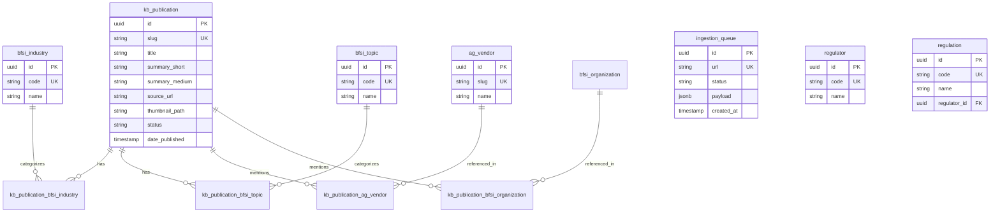

# Data Model

## Overview

The database uses Supabase (Postgres) with Row Level Security (RLS).

## Entity Relationship Diagram

## Table Categories

### Core Tables

| Table                   | Purpose                     |
| ----------------------- | --------------------------- |
| `kb_publication`        | Published content           |
| `kb_publication_pretty` | Flattened view for frontend |
| `ingestion_queue`       | Processing pipeline         |
| `kb_source`             | RSS feed configurations     |

### Guardrail Taxonomies (curated, fixed)

| Table            | Rows | Purpose            |
| ---------------- | ---- | ------------------ |
| `bfsi_industry`  | 53   | Banking sectors    |
| `bfsi_topic`     | 5    | Content categories |
| `bfsi_geography` | —    | Countries/regions  |
| `ag_use_case`    | 16   | AI use cases       |
| `ag_capability`  | 24   | AI capabilities    |
| `regulator`      | 18   | Regulatory bodies  |
| `regulation`     | 18   | Laws/regulations   |

### Expandable Taxonomies (grow from content)

| Table               | Rows | Purpose         |
| ------------------- | ---- | --------------- |
| `bfsi_organization` | 8    | Banks, insurers |
| `ag_vendor`         | 81   | AI/tech vendors |

### Junction Tables (M:N)

| Table                              | Links                       |
| ---------------------------------- | --------------------------- |
| `kb_publication_bfsi_industry`     | Publication ↔ Industry     |
| `kb_publication_bfsi_topic`        | Publication ↔ Topic        |
| `kb_publication_ag_vendor`         | Publication ↔ Vendor       |
| `kb_publication_bfsi_organization` | Publication ↔ Organization |
