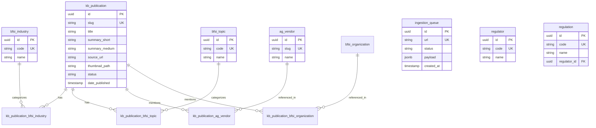

# Data Model

## Overview

The database uses Supabase (Postgres) with Row Level Security (RLS).

## Entity Relationship Diagram

## Table Categories

### Core Tables

| Table                   | Purpose                           |
| ----------------------- | --------------------------------- |
| `kb_publication`        | Published content                 |
| `kb_publication_pretty` | Flattened view for frontend       |
| `ingestion_queue`       | Processing pipeline               |
| `kb_source`             | Content sources (feeds, scrapers) |
| `kb_channel`            | Strategic information streams     |

## Content Metadata Concepts (KB-171)

Four distinct concepts structure content metadata:

| Concept                       | Meaning                        | Examples                                   |
| ----------------------------- | ------------------------------ | ------------------------------------------ |
| `kb_source.category`          | Type of producing organization | regulator, central_bank, vendor, academic  |
| `kb_publication.content_type` | Form of the document           | article, report, peer-reviewed-paper       |
| `bfsi_topic`                  | High-level subject theme       | credit_risk, payments, digital_identity    |
| `kb_channel`                  | Strategic information stream   | regulatory_intelligence, academic_research |

### Channels (kb_channel)

Strategic groupings that define why content exists in the platform:

| Slug                      | Name                          | Purpose                                          |
| ------------------------- | ----------------------------- | ------------------------------------------------ |
| `regulatory_intelligence` | Regulatory Intelligence       | Official regulatory publications, guidelines     |
| `prudential_statistics`   | Prudential & Risk Statistics  | Statistical data from central banks, BIS, IMF    |
| `market_disclosures`      | Market Disclosures            | Annual reports, 10-K filings, IR content         |
| `industry_insights`       | Industry Insights             | Thought leadership from consulting & trade media |
| `vendor_innovation`       | Vendor & Innovation Insights  | Product updates, case studies from tech vendors  |
| `academic_research`       | Academic & Technical Research | Papers from arXiv, SSRN, universities            |
| `open_datasets`           | Open Datasets & Indicators    | Structured data from Open Banking, CBS, etc.     |

### Source Categories (kb_source.category)

| Value             | Description                                   |
| ----------------- | --------------------------------------------- |
| `regulator`       | Supervisory authorities (EBA, ESMA, AFM, FCA) |
| `central_bank`    | Central banks (ECB, Fed, DNB)                 |
| `vendor`          | Technology vendors (BFSI and AI/agentic)      |
| `research`        | Research organizations, think tanks           |
| `consulting`      | Big 4, strategy consulting firms              |
| `media_outlet`    | News, trade publications                      |
| `standards_body`  | NIST, ISO, BCBS, FATF, W3C                    |
| `academic`        | Universities, academic publishers             |
| `government_body` | Government agencies (non-regulatory)          |

### Guardrail Taxonomies (curated, fixed)

| Table            | Rows | Purpose            |
| ---------------- | ---- | ------------------ |
| `bfsi_industry`  | 53   | Banking sectors    |
| `bfsi_topic`     | 5    | Content categories |
| `bfsi_geography` | —    | Countries/regions  |
| `ag_use_case`    | 16   | AI use cases       |
| `ag_capability`  | 24   | AI capabilities    |
| `regulator`      | 18   | Regulatory bodies  |
| `regulation`     | 18   | Laws/regulations   |

### Expandable Taxonomies (grow from content)

| Table               | Rows | Purpose         |
| ------------------- | ---- | --------------- |
| `bfsi_organization` | 8    | Banks, insurers |
| `ag_vendor`         | 81   | AI/tech vendors |

### Junction Tables (M:N)

| Table                              | Links                      |
| ---------------------------------- | -------------------------- |
| `kb_publication_bfsi_industry`     | Publication ↔ Industry     |
| `kb_publication_bfsi_topic`        | Publication ↔ Topic        |
| `kb_publication_ag_vendor`         | Publication ↔ Vendor       |
| `kb_publication_bfsi_organization` | Publication ↔ Organization |
