# Data Flow Diagram (Level 1)

## Overview

Shows how data flows through the system from input to output.

## System Data Flow

```mermaid
flowchart TB
    subgraph External["External Sources"]
        RSS[("🌐 RSS Feeds")]
        Admin["👤 Admin"]
        OpenAI["🤖 OpenAI API"]
    end

    subgraph Processing["Agent API"]
        Discovery["Discovery Agent"]
        Enrich["Enrichment Pipeline"]
    end

    subgraph Storage["Supabase"]
        Queue[("ingestion_queue")]
        Pub[("kb_publication")]
        Thumbs[("Storage: thumbnails")]
        Taxonomy[("Taxonomy Tables")]
    end

    subgraph Output["Output"]
        Astro["Astro Build"]
        CDN["Cloudflare CDN"]
        Users["👥 Public Users"]
    end

    RSS -->|URLs| Discovery
    Admin -->|Manual URL| Queue
    Discovery -->|New URLs| Queue
    Queue -->|Pending items| Enrich
    Enrich <-->|LLM calls| OpenAI
    Enrich -->|Enriched data| Queue
    Enrich -->|Screenshots| Thumbs
    Taxonomy -->|Codes| Enrich
    Queue -->|Approved| Pub
    Pub -->|Query| Astro
    Thumbs -->|Images| Astro
    Astro -->|Static HTML| CDN
    CDN -->|Pages| Users
```

## Data Stores

| Store                 | Type   | Contents                              |
| --------------------- | ------ | ------------------------------------- |
| `ingestion_queue`     | Table  | URLs being processed, status, payload |
| `kb_publication`      | Table  | Published articles                    |
| `kb_source`           | Table  | RSS feed configurations               |
| `Storage: thumbnails` | Bucket | Article screenshots                   |
| Taxonomy tables       | Tables | Industries, topics, vendors, etc.     |

## Data Transformations

| Stage         | Input           | Output                      |
| ------------- | --------------- | --------------------------- |
| **Discovery** | RSS XML         | URLs + metadata             |
| **Filter**    | URL + HTML      | Relevance score             |
| **Summarize** | HTML content    | Short/medium/long summaries |
| **Tag**       | Title + summary | Taxonomy codes              |
| **Thumbnail** | URL             | Screenshot image            |
| **Approve**   | Enriched item   | Published article           |
